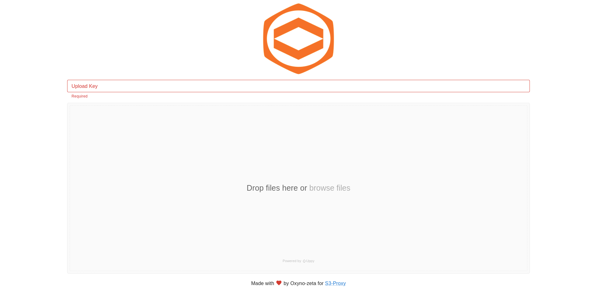

<h1 align="center"></h1>
<h1 align="center">S3-Proxy Interfaces</h1>

  
  

## What is this project ?

This project is a monorepo of interfaces for <a href="https://github.com/oxyno-zeta/s3-proxy" target="_blank">S3-Proxy</a>.

S3-Proxy can be used to have a graphical interface over S3 buckets but the generated pages are simples, cannot offer the upload and delete feature,...

This project allow to change this to have a better feature support and a Material based interface.

Each interface is considered as a standalone project and have dedicated pages with features, instructions, ...

## Interfaces

| [Upload-only](interfaces/upload-only)                                               | [Dashboard](interfaces/dashboard)                                               |
| ----------------------------------------------------------------------------------- | ------------------------------------------------------------------------------- |
|  |  |

## Want to contribute ?

- Read the [CONTRIBUTING guide](./CONTRIBUTING.md)

## Thanks

- My wife BH to support me doing this

## Author

- Oxyno-zeta (Havrileck Alexandre)

## License

Apache 2.0 (See in LICENSE)
